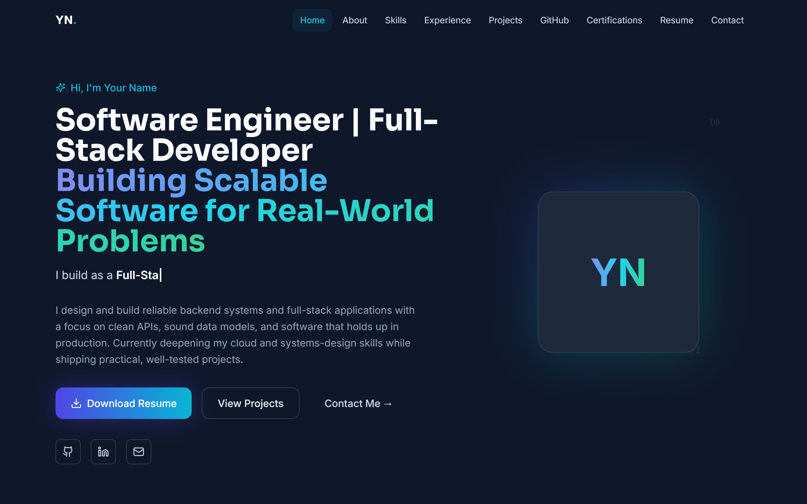
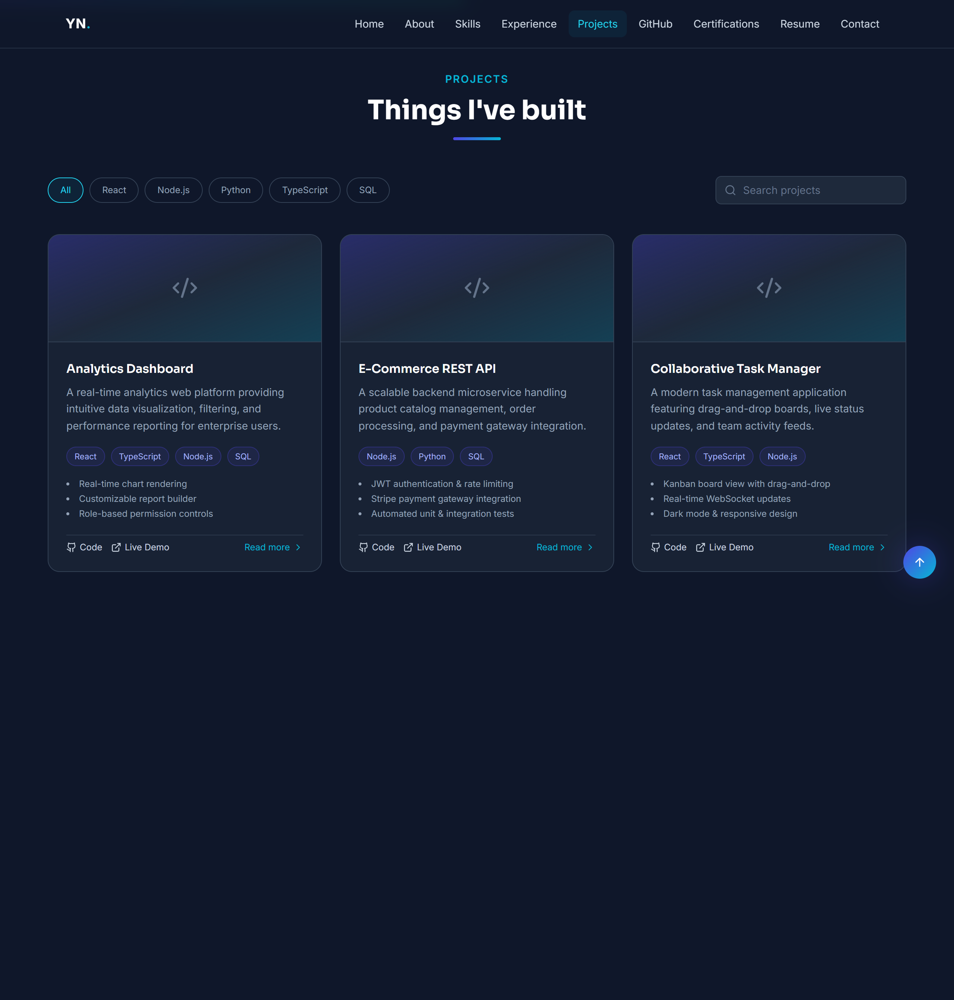
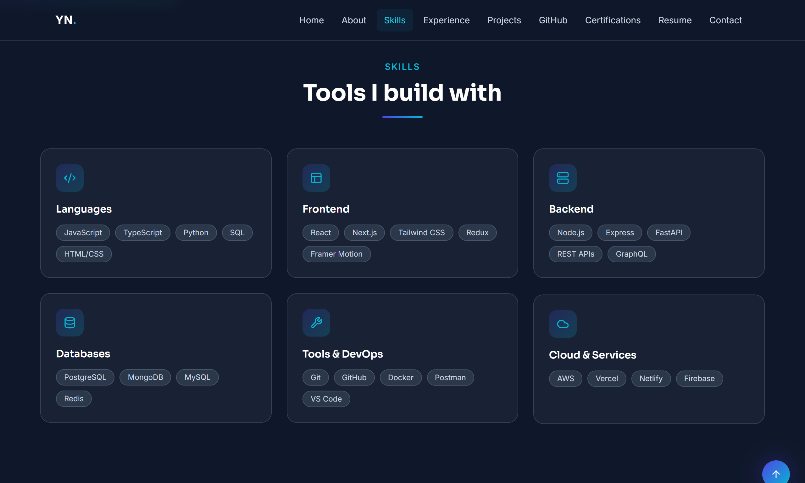
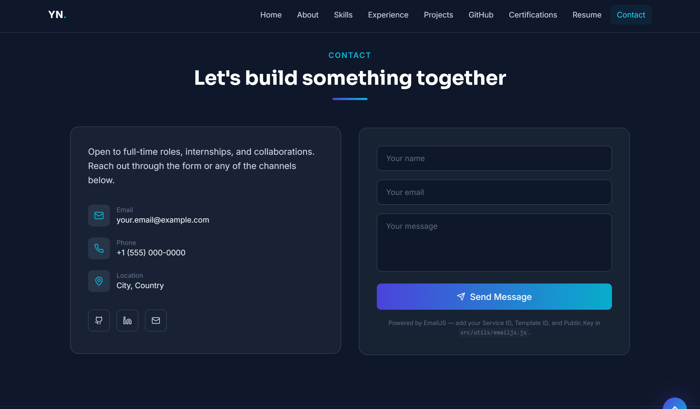

# ⚡ React Portfolio Template

[](https://opensource.org/licenses/MIT)
[](https://react.dev/)
[](https://vitejs.dev/)
[](https://tailwindcss.com/)
[](https://www.framer.com/motion/)

A premium, modern, dark-themed personal portfolio template built with **React 18**, **Vite**, **Tailwind CSS**, and **Framer Motion**. Designed specifically for software engineers, full-stack developers, and technology enthusiasts who want an open-source, data-driven, and highly customizable personal website.

---

## 🌟 Features

- 🎯 **100% Data-Driven Architecture**: Easily customize all content in modular files without touching component code.
- ⚙️ **Centralized Profile Config**: One `src/data/profile.js` file updates your name, bio, role, social links, and skills globally.
- ✨ **Rich Animations & Interactive UI**:
  - **Framer Motion**: Smooth scroll reveals & staggered entrance effects.
  - **3D Card Tilt**: Interactive tilt hover animations on project & certification cards (`react-tilt`).
  - **Typewriter Effect**: Dynamic typing text loop in hero section (`react-type-animation`).
  - **Particle Graph**: Custom particle network background (`react-tsparticles`).
  - **Animated Counter**: GitHub contribution & repo count animations (`react-countup`).
- 📧 **Working Contact Form**: Built-in EmailJS integration with client-side validation and toast notifications (`react-hot-toast`).
- 📱 **Fully Responsive Layout**: Looks stunning across mobile, tablet, desktop, and ultra-wide displays.
- ♿ **Accessibility & Motion Preference**: Respects `prefers-reduced-motion` settings automatically.
- 🔍 **SEO & Metadata Pre-configured**: Semantic HTML5 tags, Open Graph meta tags, canonical links, and JSON-LD structured schema.
- 🧭 **Single Page Navigation**: Smooth scrollspy navigation bar with active section indicator.

---

## 📸 Screenshots

| Hero & Intro | Projects & 3D Tilt |
| :---: | :---: |
|  |  |

| Skills & Experience | Contact Form & Toast |
| :---: | :---: |
|  |  |

---

## 🛠️ Tech Stack

- **Framework**: [React 18](https://react.dev/) + [Vite 5](https://vitejs.dev/)
- **Styling**: [Tailwind CSS 3](https://tailwindcss.com/) + PostCSS
- **Icons**: [Lucide React](https://lucide.dev/)
- **Animations**: [Framer Motion](https://www.framer.com/motion/), [React Tilt](https://github.com/jonathandion/react-tilt), [React Type Animation](https://github.com/react-type-animation/react-type-animation)
- **Particles**: [React TS Particles](https://particles.js.org/) + `tsparticles-slim`
- **Routing**: [React Router DOM v6](https://reactrouter.com/)
- **Forms & Notifications**: [EmailJS](https://www.emailjs.com/) + [React Hot Toast](https://react-hot-toast.com/)

---

## 📁 Folder Structure

```
portfolio/
├── public/                # Static assets (favicon, robots.txt, sitemap.xml, resume.pdf)
├── src/
│   ├── animations/        # Shared Framer Motion variant definitions
│   ├── assets/            # Static images and visual assets
│   ├── components/        # Reusable UI building blocks (Navbar, Footer, Cards, etc.)
│   ├── data/              # Modular data files (profile, projects, skills, etc.)
│   │   ├── profile.js        # Centralized profile & bio configuration
│   │   ├── projects.js       # Projects list & category filter tags
│   │   ├── skills.js         # Skill categories & icons
│   │   ├── experience.js     # Work history timeline & accomplishments
│   │   ├── certifications.js # Industry credentials & learning badges
│   │   ├── github.js         # GitHub statistics & language breakdown
│   │   ├── navigation.js     # Navigation bar links
│   │   └── socials.js        # Social links mapping
│   ├── hooks/             # Custom React hooks (scroll spy, progress bar, cursor glow)
│   ├── pages/             # Page components (Home, NotFound 404)
│   ├── sections/          # Landing page sections (Hero, About, Skills, Projects, etc.)
│   ├── styles/            # Tailwind CSS directives & global style definitions
│   ├── utils/             # Helper utilities & EmailJS configuration
│   ├── App.jsx            # Main App wrapper & Router setup
│   └── main.jsx           # Application DOM entry point
├── .env.example           # Example environment variables for EmailJS
├── CHANGELOG.md           # Template release notes
├── LICENSE                # MIT License
├── README.md              # Project documentation
├── SETUP.md               # Beginner step-by-step setup guide
├── index.html             # HTML entry point & SEO metadata
├── tailwind.config.js     # Tailwind theme tokens & color extensions
└── vite.config.js         # Vite bundler options
```

---

## 🚀 Quick Start & Installation

### 1. Click "Use this template"
On GitHub, click the green **"Use this template"** button to generate a new repository in your account.

### 2. Clone Repository
```bash
git clone https://github.com/yourusername/your-portfolio-name.git
cd your-portfolio-name
```

### 3. Install Dependencies
```bash
npm install
```

### 4. Start Local Development Server
```bash
npm run dev
```
Open [http://localhost:5173](http://localhost:5173) in your browser to view your live site.

---

## ⚙️ Customization Guide

All personal data is isolated inside `src/data/`. Modifying these files automatically updates your site.

### 1. Profile & Bio Configuration (`src/data/profile.js`)
Edit `src/data/profile.js` to change your name, role, bio, social links, location, and typing animation:
```javascript
export const PROFILE = {
  name: "Your Name",
  role: "Full Stack Developer",
  headline: "Software Engineer | Full-Stack Developer",
  tagline: "Building Scalable Software for Real-World Problems",
  bio: "Your personalized bio summary...",
  email: "your.email@example.com",
  github: "https://github.com/yourusername",
  linkedin: "https://linkedin.com/in/yourusername",
  // ...
};
```

### 2. Projects (`src/data/projects.js`)
Add your own projects in `src/data/projects.js`:
```javascript
export const PROJECTS = [
  {
    id: "my-awesome-project",
    title: "Project Name",
    description: "Brief summary of what the project does...",
    tech: ["React", "TypeScript", "Node.js"],
    features: ["Key feature 1", "Key feature 2"],
    image: "/projects/my-project.png",
    github: "https://github.com/yourusername/project",
    demo: "https://my-demo-link.com",
  },
];
```

### 3. Work Experience (`src/data/experience.js`)
Update your job roles, internship details, and key accomplishments in `src/data/experience.js`.

### 4. Skills & Certifications (`src/data/skills.js` & `src/data/certifications.js`)
Add skill groups and industry credentials in their respective configuration files.

### 5. Resume & Profile Image
- **Resume**: Save your PDF file to `public/resume.pdf`. The download and view buttons will link straight to it.
- **Profile Photo**: Save your picture to `public/profile.jpg` or `src/assets/images/profile.jpg` and reference it in `PROFILE.avatar`.

### 6. EmailJS Contact Form Setup
1. Create a free account at [EmailJS](https://www.emailjs.com/).
2. Copy your `.env.example` to `.env`:
   ```bash
   cp .env.example .env
   ```
3. Add your keys to `.env`:
   ```env
   VITE_EMAILJS_SERVICE_ID=your_service_id
   VITE_EMAILJS_TEMPLATE_ID=your_template_id
   VITE_EMAILJS_PUBLIC_KEY=your_public_key
   ```

---

## 📦 Build & Preview

To compile a production build:
```bash
npm run build
```

To preview the production build locally:
```bash
npm run preview
```

The output will be placed in the `dist/` directory, ready for deployment.

---

## 🌐 Deployment Guide

### Vercel (Recommended)
1. Import your repository into [Vercel](https://vercel.com).
2. Set Environment Variables in Project Settings (`VITE_EMAILJS_SERVICE_ID`, etc.).
3. Click **Deploy**.

### Netlify
1. Connect your GitHub repository on [Netlify](https://netlify.com).
2. Set the build command to `npm run build` and publish directory to `dist`.
3. Add Environment Variables under Site Settings.

### GitHub Pages
Add `gh-pages` or use GitHub Actions with `upload-pages-artifact` targeting the `dist` folder.

---

## ❓ Common Issues & Troubleshooting

| Issue | Cause | Solution |
| :--- | :--- | :--- |
| **Blank White Screen** | Missing import or syntax error in custom data file | Run `npm run build` in terminal to see exact line numbers of any build or import errors. |
| **Contact Form Errors** | Unconfigured EmailJS environment variables | Verify `.env` contains valid `VITE_EMAILJS_*` keys and restart `npm run dev`. |
| **404 on Resume Link** | Missing `resume.pdf` file | Ensure `resume.pdf` exists inside the `public/` directory. |

---

## 📜 License

Distributed under the **MIT License**. See [`LICENSE`](./LICENSE) for more details.

---

## 🤝 Contributing

Contributions, issues, and feature requests are welcome! Feel free to check the [issues page](https://github.com/yourusername/portfolio-template/issues).

---

⭐ **If you find this template helpful, please consider giving it a star on GitHub!**
